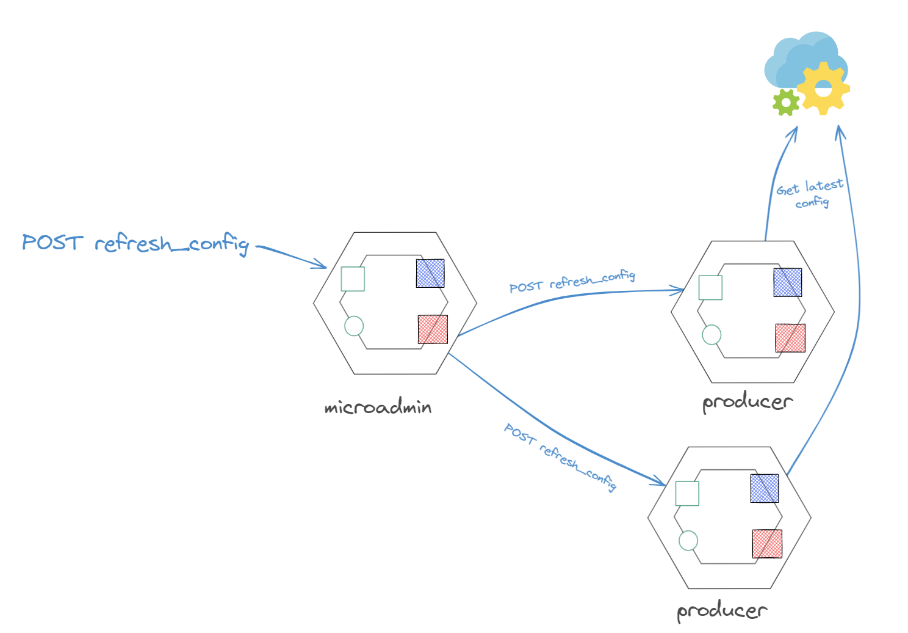

# microadmin
Admin k8s microservice in go

# Architecture



# Permissions needed to execute this microservice

## Service account

```yaml
apiVersion: v1
kind: ServiceAccount
metadata:
  name: microadmin-account
  namespace: default
```

kubectl apply -f create_new_service_account.yaml


## Create a role with required permissions

```yaml
apiVersion: rbac.authorization.k8s.io/v1
kind: Role
metadata:
  namespace: default
  name: pod-reader
rules:
- apiGroups: [""]
  resources: ["pods"]
  verbs: ["get", "watch", "list"]
```

kubectl apply -f create_role_with_permissions.yaml

## Bind the role to the service account

```yaml
apiVersion: rbac.authorization.k8s.io/v1
kind: RoleBinding
metadata:
  name: read-pods
  namespace: default
subjects:
- kind: ServiceAccount
  name: microadmin-account
  namespace: default
roleRef:
  kind: Role
  name: pod-reader
  apiGroup: rbac.authorization.k8s.io
```

kubectl apply -f bind_role_with_service_account.yaml

## Update microservice deployment to use the new service account

```yaml
apiVersion: apps/v1
kind: Deployment
metadata:
  name: microadmin
spec:
  replicas: 1
  template:
    metadata:
      labels:
        app: microadmin
    spec:
      serviceAccountName: microadmin-account
      containers:
      - name: microadmin
        image: microadmin:latest
```

Update serviceAccountName in the deployment manifest.